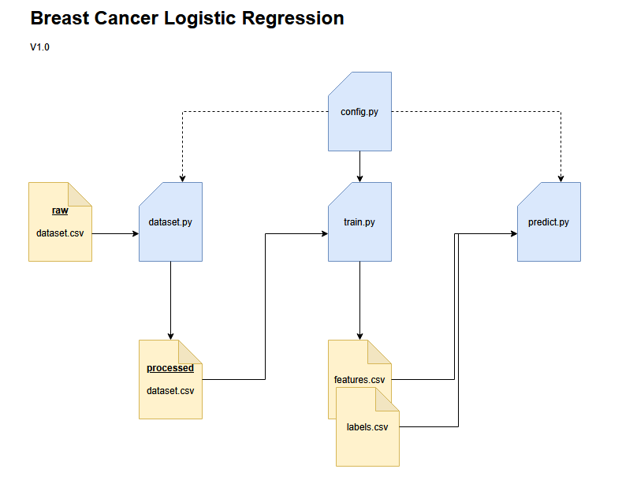

# Breast Cancer Classification

## 1. Team Information
- Team Name: Team Python
- Team Members: (Megan Davis, MDAVI166@depaul.edu), (Nikki Frank, NFRANK6@depaul.edu), (Abe Berkley-Vigil, ABERKLEY@depaul.edu)
- Course & Section: SE 489 Section 930, 910

## 2. Project Overview
- Summary: Radiologists study for years to be able to accurately identify whether cancer is present in the images they gather, but they can still make errors. To improve their accuracy, we need to deploy a sustainable and reproducible machine learning model that can detect cancer in breast screenings and continuously improve its predictions as it’s presented with new data. This tool must generate the same predictions on various machines.
- Problem statement: Build a successful supervised binary classification model for detecting breast cancer. This will allow doctors to have a “second set of eyes” when identifying patients with breast cancer.
- Main objectives: Leverage 3rd party ML tools, version controlling, templates and docker containers to allow for continuous development and integration of a machine learning model to be used seamlessly by anyone given access to it.

## 3a. Project Architecture Diagram


## 3b. Project Organization Diagram
<a target="_blank" href="https://cookiecutter-data-science.drivendata.org/">
    
</a>

```
├── LICENSE            <- Open-source license if one is chosen
├── Makefile           <- Makefile with convenience commands like `make process_data` or `make train_model`
├── README.md          <- The top-level README for developers using this project.
├── data
│   ├── external       <- Data from third party sources.
│   ├── interim        <- Intermediate data that has been transformed.
│   ├── processed      <- The final, canonical data sets for modeling.
│   └── raw            <- The original, immutable data dump. copy of dvc controlled data
|   breast-cancer.csv  <- the dvc tracked dataset
│
├── docs               <- Default location for supporting documation documents.
│
├── experiments        <- Where modeling experiments will take place
|   └── wandb          <- Where wandb experimentation scripts are housed.
|
├── models             <- Trained and serialized models, model predictions, or model summaries
│
├── notebooks          <- Jupyter notebooks. Naming convention is a number (for ordering),
│                         the creator's initials, and a short `-` delimited description, e.g.
│                         `1.0-jqp-initial-data-exploration`.
|
├── profiling          <- Profiling scripts to read and write results files
│
├── pyproject.toml     <- Project configuration file with package metadata for 
│                         breast_cancer_classification and configuration for tools like black
│
├── references         <- Data dictionaries, manuals, and all other explanatory materials.
│
├── reports            <- Generated analysis as HTML, PDF, LaTeX, etc.
│   └── figures        <- Generated graphics and figures to be used in reporting
|   └── profiling      <- Generated tables and results from profiling
│
├── requirements.txt   <- The requirements file for reproducing the analysis environment, e.g.
│                         generated with `pip freeze > requirements.txt`
│
├── setup.cfg          <- Configuration file for flake8
|
├── wandb              <- Auto generated storage for all experiment run data resides from weights and biases.
│
└── beast_cancer_classification   <- Source code for use in this project.
    │
    ├── __init__.py             <- Makes beast_cancer_classification a Python module
    │
    ├── config.py               <- Store useful variables and configuration
    │
    ├── dataset.py              <- Scripts to download or generate data
    │
    ├── modeling                
    │   ├── __init__.py 
    │   ├── predict.py          <- Code to run model inference with trained models          
    │   └── train.py            <- Code to train models
    │
    └── plots.py                <- Code to create visualizations
```

--------


## 4. Phase Deliverables
- [PHASE1.md](./PHASE1.md): Project Design & Model Development
- [PHASE2.md](./PHASE2.md): Enhancing ML Operations
- [PHASE3.md](coming in future release): Continuous ML & Deployment


## 5. Setup Instructions
Conda was used for building and testing the makefile. Using anything else may require modification of the commands.

- How to set up the environment: 
    - Environmental setup can be handle by running a set of commands through the makefile. 
    - `make create_environment`: This command will setup a python interpreter environment. (Conda)
    - `make requirements`: Will install all Python dependencies.
- How to get the data via dvc, you will need to to successfully run the code
    - you need access to the secret key .dvc/secrets is where it's stored but you may need to contact the project owner to get the key
    - pip install dvc[gdrive] if you haven't already installed requirements
    - run dvc init in order to connect with the remote repo
    - run dvc pull
- How to run the code and reproduce results: 
    - `make process_data`: This will run the data processing step of the model pipeline.
    - `make train_model`: This will run the modeling training step of the model pipeline.
    - `make test_model` : This will run the test step of the model pipeline.
    - Lastly if you wish to run all the steps at once `make run_full_model_pipeline`.

## 6. Contribution Summary
- Megan set up the repository and created the wiki page. She took the lead on addressing questions pertaining to git and version control, coded the KNN classifier, contributed to overall documentation, and parsed selected exploratory methods into different callable functions.
- Nikki created the dvc pipeline, explored the data and logistic regression performance, and produced the logistic regression model that we ultimately chose to move forward with for this project, and she contributed to overall documentation. In additon, she did the profiling and model experimentation on the project.
- Abe contributed in writing the report, and readme. Additionally, Abe brought questions to the professor and esnured the team and project were steering in the right direction. Finally, Abe did some exploratory work considering the viability of the SVM model for this project.

## 7. References
- Third Party Tools Used Scikit learn, Pandas, Numpy, Seaborn, Cookiecutter-data-science, loguru, typer  
- Breast Cancer Data Set: https://www.kaggle.com/datasets/yasserh/breast-cancer-dataset/data
- Frameworks: Scikit-learn, DVC, Hydra

---

